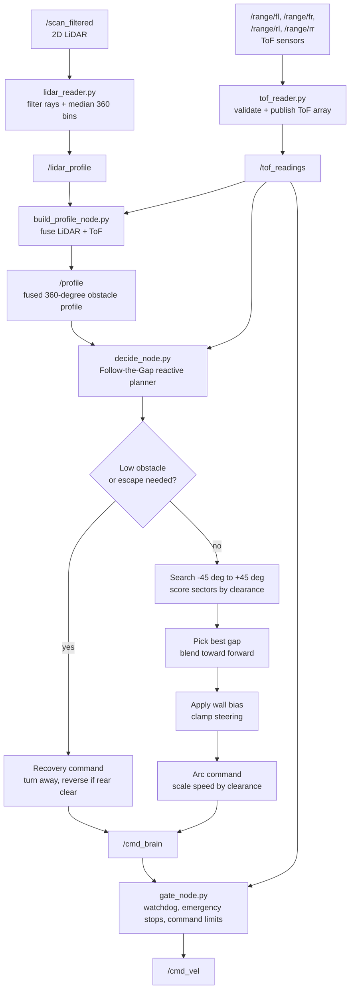

# Reactive Obstacle Avoidance

This codebase implements a ROS 2 reactive obstacle avoidance pipeline for a mobile robot. The main controller uses a Follow-the-Gap (FTG) style model over a fused 360-degree obstacle profile, then sends commands through a safety gate before publishing `/cmd_vel`.

## Sensor It Use

The system uses three sensor/data sources:

| Source | ROS topic | Used by | Purpose |
| --- | --- | --- | --- |
| 2D LiDAR | `/scan_filtered` (`sensor_msgs/LaserScan`) | `lidar_reader.py` | Builds a 360-bin distance profile, one bin per degree. |
| Four ToF range sensors | `/range/fl`, `/range/fr`, `/range/rl`, `/range/rr` (`sensor_msgs/LaserScan`) | `tof_reader.py` | Detects close obstacles near front-left, front-right, rear-left, and rear-right corners. |
| Odometry | `/odometry/filtered` (`nav_msgs/Odometry`) | `odometry_reader.py` | Publishes pose and velocity for logging/analysis. It is not used by the reactive controller. |

Sensor orientation used by the obstacle profile:

| Profile index | Direction |
| --- | --- |
| `0` | Forward |
| `90` | Left |
| `180` | Rear |
| `270` or `-90` | Right |

The ToF array is published as:

```text
/tof_readings = [front_left, front_right, rear_left, rear_right]
```

Invalid ToF readings are treated as `0.9 m`, which means clear at the sensor maximum range.

## Process

The active runtime pipeline is:

1. `lidar_reader.py` subscribes to `/scan_filtered`.
2. It filters invalid LiDAR rays and rejects readings outside `0.15 m` to `12.0 m`.
3. It groups valid rays into 360 one-degree bins and publishes the median distance per bin on `/lidar_profile`.
4. `tof_reader.py` subscribes to the four ToF topics and publishes `/tof_readings` at 10 Hz.
5. `build_profile_node.py` fuses `/lidar_profile` and `/tof_readings` into `/profile`.
6. `decide_node.py` runs the Follow-the-Gap reactive planner on `/profile`, checks ToF readings for low/corner obstacles, and publishes `/cmd_brain`.
7. `gate_node.py` is the only node that publishes `/cmd_vel`. It clamps command limits, stops stale commands, and blocks unsafe forward or reverse motion using ToF emergency thresholds.

Supporting nodes:

| File | Role |
| --- | --- |
| `odometry_reader.py` | Converts odometry into `/robot_pose` and `/robot_velocity`. |
| `data_logger.py` | Logs state, distances, pose, velocity, and commands to CSV under `~/ros2_ws/logs`. Some subscribed topic names appear to match an older interface, so check them before using this logger with the current active pipeline. |

## The Reactive Model: Follow The Gap

The controller in `decide_node.py` is a reactive planner. It does not use a map, a global path, TF, or a goal pose. Each decision is made from the latest fused obstacle profile and ToF readings.

The FTG behavior works like this:

1. Search only the reachable forward corridor from `-60 deg` to `+60 deg`.
2. For each candidate direction, inspect a sector of `theta +/- 20 deg`.
3. Score the direction by the minimum clearance in that sector plus a forward bias:

```text
score(theta) = min_clearance(theta +/- SECTOR_HALF) + FORWARD_BIAS * cos(theta)
```

4. Reduce the score for turns toward close side or corner obstacles.
5. Pick the best-scoring direction as the gap direction.
6. Blend the gap direction back toward straight ahead based on front clearance:

```text
k = GAP_WEIGHT / front_distance
theta_final = (k * theta_gap) / (k + 1)
```

7. Add wall bias if a left or right side/corner is too close.
8. Clamp steering to `+/-45 deg`.
9. Convert the selected steering direction into a curved arc command `(linear velocity, angular velocity)`.
10. Reduce speed when front, side, or corner clearance is low.
11. Enter escape/recovery mode if front ToF sensors detect a close low obstacle.

Important safety behavior:

- If front clearance is below `FRONT_STOP`, the planner commands zero velocity.
- If one front ToF corner is very close, the robot turns away from that side.
- If rear ToF clearance is sufficient, recovery may include a small reverse velocity.
- `gate_node.py` applies the final hard stop and command limits before `/cmd_vel`.

## Diagram Of The Logic



## Hyperparameters

### LiDAR Profile

| Parameter | Value | Meaning |
| --- | ---: | --- |
| `lidar_reader.MIN_RANGE` | `0.15 m` | Ignore readings closer than this. |
| `lidar_reader.MAX_RANGE` | `12.0 m` | Ignore readings farther than this and use as empty-bin value. |
| LiDAR bins | `360` | One distance bin per degree. |

### ToF Fusion

| Parameter | Value | Meaning |
| --- | ---: | --- |
| `tof_reader.MAX_RANGE` | `0.9 m` | ToF maximum range; also used as clear value. |
| `build_profile_node.TOF_HALF_FOV` | `12.5 deg` | Half field-of-view projected into profile bins. |
| `build_profile_node.FRONT_PROTECT_DEG` | `10 deg` | Front zone protected from direct FL/FR ToF lowering. |
| FL center | `+12.5 deg` | Front-left ToF projection center. |
| FR center | `-12.5 deg` | Front-right ToF projection center. |
| RL center | `+167.5 deg` | Rear-left ToF projection center. |
| RR center | `-167.5 deg` | Rear-right ToF projection center. |

### Follow-the-Gap Planner

| Parameter | Value | Meaning |
| --- | ---: | --- |
| `R` | `0.167 m` | Robot half-width. |
| `D_MAX` | `3.0 m` | Planner profile max/no-obstacle sentinel. |
| `SECTOR_HALF` | `20 deg` | Half-width of each scored clearance sector. |
| `FORWARD_BIAS` | `0.25 m` | Bonus for forward-facing candidate directions. |
| `GAP_WEIGHT` | `80.0` | Weight used when blending gap direction with forward. |
| `SEARCH_DEG` | `60 deg` | Candidate search corridor from `-60 deg` to `+60 deg`. |
| `FRONT_HALF` | `10 deg` | Front stop clearance sector. |
| `SIDE_CLEAR` | `0.40 m` | Clearance where side/corner wall bias begins. |
| `MAX_STEER` | `45 deg` | Maximum final steering angle. |

### Speed And Recovery

| Parameter | Value | Meaning |
| --- | ---: | --- |
| `FRONT_STOP` | `0.22 m` | Planner stop distance. |
| `TOF_PAIR_STOP` | `0.28 m` | Front ToF pair threshold used when both front ToFs agree. |
| `DVEL_SAFE` | `0.75 m` | Distance where speed reduction begins. |
| `V_MAX` | `0.18 m/s` | Planner maximum linear velocity. |
| `OMEGA_MAX` | `0.6 rad/s` | Planner maximum angular velocity. |
| `ACCEL_LIMIT` | `0.08 m/s^2` | Linear acceleration limit. |
| `OMEGA_ACCEL` | `0.5 rad/s^2` | Angular acceleration limit. |
| `ESCAPE_ENTER` | `0.28 m` | ToF threshold to enter escape mode. |
| `ESCAPE_EXIT` | `0.36 m` | ToF threshold to leave escape mode. |
| `ESCAPE_MIN_TIME` | `1.0 s` | Minimum time to stay in escape mode. |
| `REAR_CLEAR` | `0.30 m` | Rear clearance needed for reverse recovery. |
| `V_ESCAPE` | `-0.05 m/s` | Reverse speed during recovery. |
| `OMEGA_ESCAPE` | `0.35 rad/s` | Turn rate during recovery. |

### Safety Gate

| Parameter | Value | Meaning |
| --- | ---: | --- |
| `EMERGENCY_DIST` | `0.25 m` | Front ToF distance that latches a front emergency. |
| `EMERGENCY_CLEAR` | `0.32 m` | Front clearance needed to release the latch. |
| `REAR_EMERGENCY_DIST` | `0.18 m` | Rear ToF distance that latches a rear emergency. |
| `REAR_EMERGENCY_CLEAR` | `0.28 m` | Rear clearance needed to release the latch. |
| `WATCHDOG_TIMEOUT` | `0.5 s` | Stop if `/cmd_brain` is stale. |
| `V_LIMIT` | `0.16 m/s` | Final velocity clamp before `/cmd_vel`. |
| `OMEGA_LIMIT` | `0.6 rad/s` | Final angular velocity clamp before `/cmd_vel`. |
